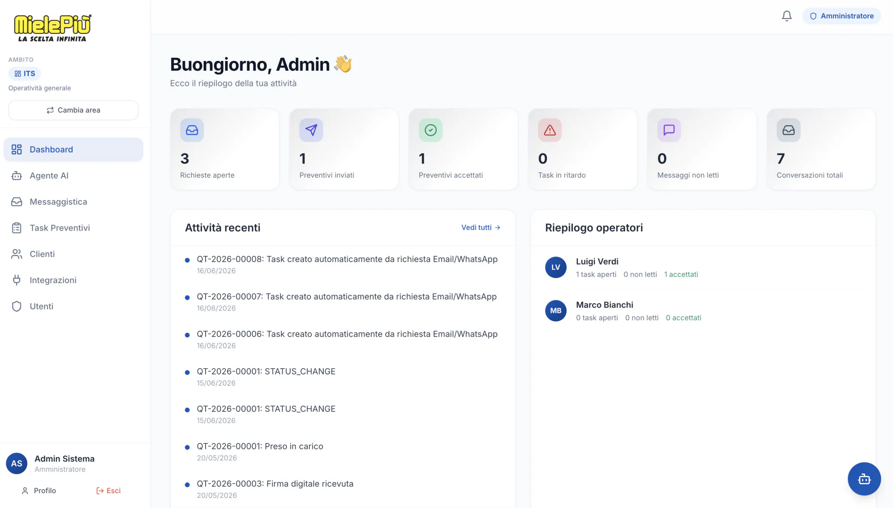
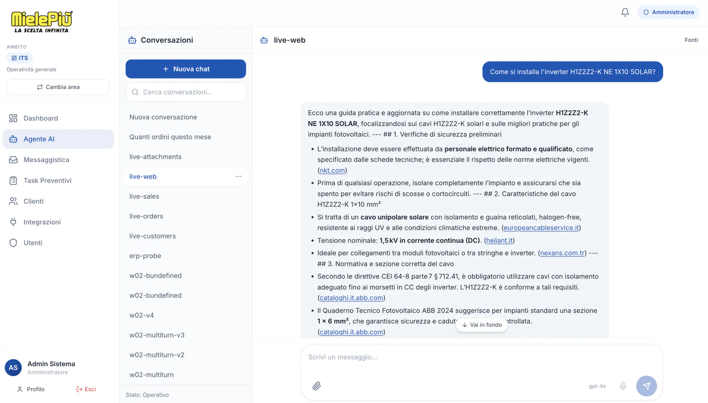

# Mielepiù — B2B sales platform with an AI agent that cites its sources

> A platform for managing customers, orders, catalogue, activities and KPIs for sales teams, with
> Email and WhatsApp as first-class inbound channels and an AI agent grounded in the platform's
> own data.

**Role**
Management modules · Workflows between requests, activities and operators · AI classification, clustering and predictive analytics

**Status**
In production

---

## The problem

A B2B sales team lives in its inbox and in WhatsApp. A request arrives as a message, someone
reads it, someone else quotes it, and the record of what was agreed exists in a thread rather
than in a system. When a customer asks "what did we quote you in March", the answer requires
someone to remember which conversation it was in.

## What I built

A platform where an inbound message becomes a tracked task automatically, and where the AI agent
answering questions about customers, orders and attachments answers **from the platform's own
data and shows what it consulted**.

## Key capabilities

- **Operational dashboard** — open requests, quotes sent and accepted, overdue tasks, unread
  messages and a per-operator summary.
- **Inbound channels** — Email and WhatsApp requests create tasks automatically; the cycle then
  runs through assignment, status changes and digital signature.
- **Customers, orders and catalogue** — the commercial records with their ERP-facing side.
- **AI agent** — separate conversations per channel (web, sales, orders, customers, attachments),
  answering with the sources it consulted.
- **Classification and clustering** — incoming requests and tasks classified automatically;
  customers and products clustered.
- **Predictive analytics** — reorder and commercial-KPI forecasting.
- **Integrations and webhooks** — external services in, signed events out, scheduled jobs.

## Architecture

The backend is organised as explicit domain modules — `customers`, `erp`, `tasks`, `inbox`,
`integrations`, `webhooks`, `notifications`, `users`, `detection`, `ai` — rather than as layers of
generic services. The module boundary is where the reasoning lives.

## Engineering decisions

**The AI module sits beside the domain modules and reads through them.** That is why an answer
can cite the record it came from.

**Types shared through the workspace, not duplicated.** The monorepo publishes a `shared-types`
package consumed by both the API and the client, so a change to the data model breaks the build
rather than the runtime. With 54 Prisma models, this is what keeps the contract honest.

**Validation at the boundary, twice.** DTOs are validated on the way in server-side, and the
client validates with its own schemas before sending. The two are independent on purpose: the
client validation is UX, the server validation is the rule.

**Sanitisation on both ends of user content.** Inbound message content is sanitised server-side
and rendered through a sanitising path client-side. Email and WhatsApp content is, by definition,
attacker-reachable input rendered back into an operator's browser.

**Second factor on accounts that can see commercial data.** TOTP is built in rather than deferred,
because the platform holds the customer list and the pricing.

## AI in the product

- **Grounded question answering** over customers, orders, attachments and sales conversations,
  with the consulted sources shown in the answer.
- **Classification** of inbound requests and tasks.
- **Clustering** of customers and products.
- **Predictive analytics** on reorders and commercial KPIs.

The agent is scoped per channel, so a conversation about attachments does not silently pull in
the whole commercial dataset.

## Security and privacy

JWT authentication with Passport, TOTP second factor, request rate limiting, security headers,
input sanitisation server-side and output sanitisation client-side, DTO validation at the
boundary, and structured logging. API surface documented with OpenAPI.

Customer identities, endpoints, providers and infrastructure are deliberately not described here.

## Stack

**Frontend**
React 18 · TypeScript · TanStack Query · Tailwind

**Backend**
NestJS 11 · TypeScript · pnpm workspace · shared-types

**Data Layer**
Prisma · 54 models

**AI & ML**
AI Agents · Grounded Q&A with sources · Classification · Clustering · Predictive analytics

**Integrations**
Email · WhatsApp · External services · Signed webhooks · Scheduled jobs · Digital signature

**Security**
JWT · Passport · TOTP · Helmet · Rate limiting · Input/output sanitisation · DTO validation

**Observability**
OpenAPI · Winston

## Result

The platform is in production. Inbound Email and WhatsApp requests become tracked work, and the
AI agent answers on commercial data with the sources attached.

## Source code

The source code is maintained in a private repository: Mielepiù is a commercial product with
client-specific implementation details. This repository documents the architecture, the
engineering decisions and the product work.

## Links

- **Interactive case study** — [francescoiaforte.vercel.app/en/projects/software-b2b](https://francescoiaforte.vercel.app/en/projects/software-b2b)
- **Profile** — [github.com/francescoveryra-dot](https://github.com/francescoveryra-dot)
- **Full portfolio** — [francescoiaforte.vercel.app](https://francescoiaforte.vercel.app)
